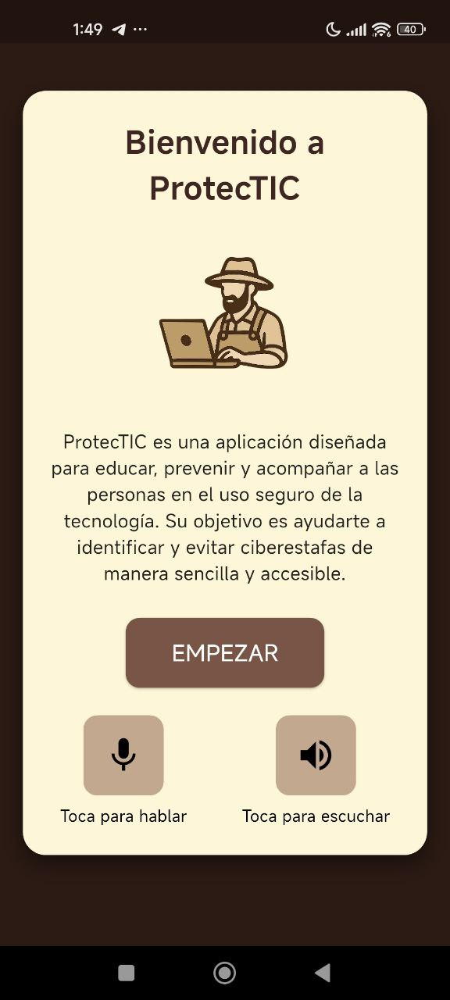
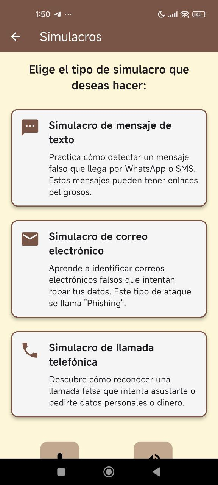
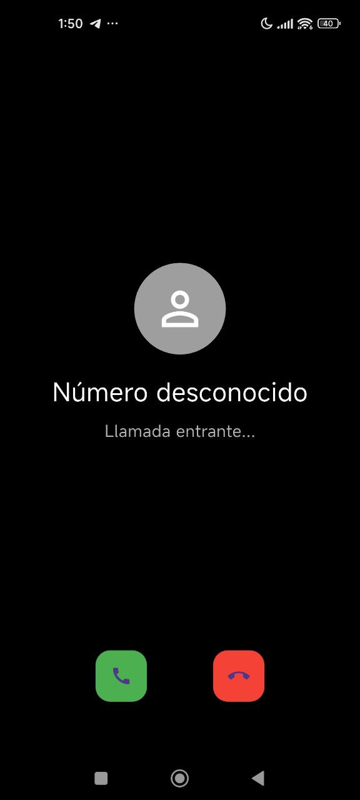
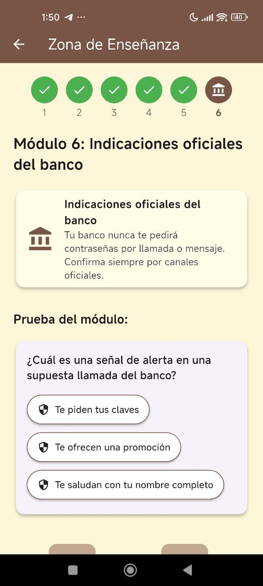

# Protect-tic

Protect-tic is an educational application focused on the **prevention of cyber scams**, designed to support people in the safe use of technology through practical simulations, pedagogical content, and accessible guidance.

The application aims to strengthen **digital literacy** and **cybersecurity awareness**, especially against common threats such as phishing, fraudulent phone calls, and deceptive messages.

---

## 🧠 About the project

Protect-tic combines **education, simulation, and accessibility** to help users identify digital risks in everyday situations.  
Unlike purely theoretical approaches, the app offers **guided experiences** that allow users to learn by recognizing real-world fraud patterns.

The design prioritizes:
- Clear and simple language  
- Intuitive interaction  
- Visual and auditory support  
- Accessibility for diverse user profiles  

---

## ✨ Main features

### 📩 Fake message and email simulations
Users can practice identifying deceptive SMS messages and emails, learning how to detect suspicious links and common warning signs associated with phishing attacks.

---

### 📞 Fake call simulations
The application includes simulations of fraudulent phone calls, helping users recognize manipulation strategies, emotional pressure, and improper requests for personal or financial information.

---

### 🎓 Modular learning area
Protect-tic features a structured modular learning area where key concepts, official recommendations, and short assessments are presented progressively to reinforce understanding.

---

## 🎓 Academic context

This project is part of an academic work focused on **accessibility, digital education, and socially impactful software development**.  
Protect-tic is referenced and contextualized in an academic book chapter published by IGI Global:

🔗 *Advancing Accessibility Through Software Development*  
https://www.igi-global.com/book/advancing-accessibility-through-software-development/384598

---

## 🛠 Tech stack

- Flutter  
- Dart  
- Cross-platform design (mobile / web)  
- Accessibility-driven and guided interaction approach  

---

## 🚀 Project status

This repository contains a functional version of the educational prototype.  
The project is under active development and can be extended with new simulations, educational content, and accessibility improvements.

---

## 📄 License

Academic and educational project.  
Intended for research, learning, and demonstration purposes.
